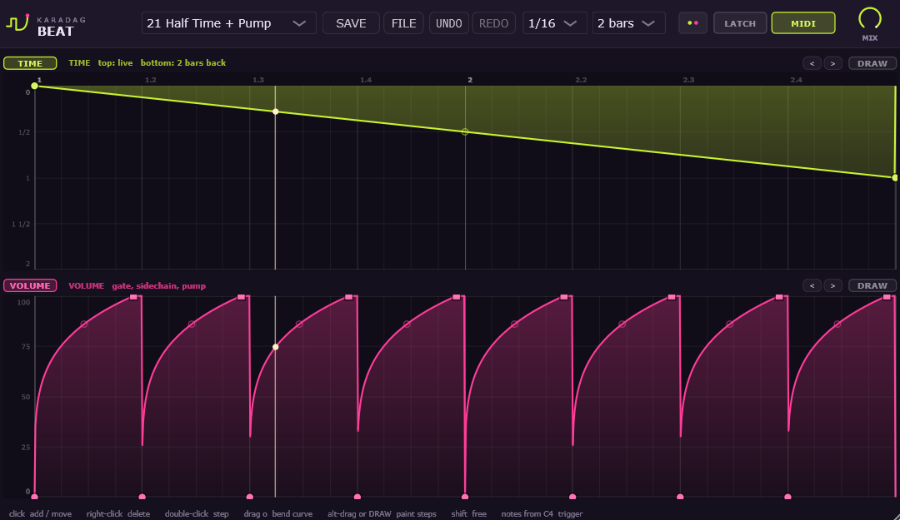
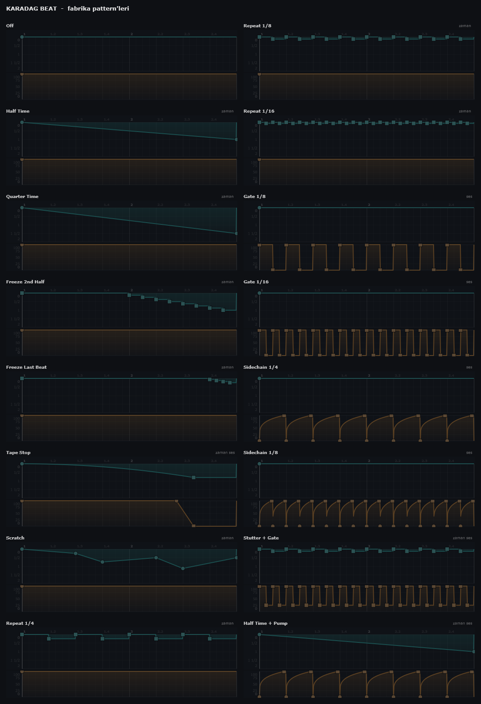

# Karadag Beat

Gross Beat tarzi, tempoya kilitli zaman ve ses manipulasyonu eklentisi. VST3 (FL Studio icin)
ve bagimsiz uygulama olarak derlenir.



---

## Ne yapiyor

Eklenti gelen sesi surekli bir halka buffer'da tutar ve pattern boyunca (1, 2 ya da 4 bar;
varsayilan 2) uzerine iki zarf uygular:

**Time zarfi** - okuma kafasinin ne kadar geriden okudugunu belirler.
Dikey eksen 0 (canli, en ust) ile bir pattern boyu geride (en alt) arasidir. Isin puf noktasi sudur:

| zarfin egimi | okuma hizi | duyulan |
|---|---|---|
| 0 (duz cizgi) | 1.0 | normal hiz, sabit gecikme |
| +0.5 | 0.5 | yarim hiz, bir oktav asagi |
| +1 | 0 | okuma kafasi yerinde sayar |
| -1 | 2.0 | cift hiz, bir oktav yukari |
| >+1 | negatif | ses geri sariyor |

Yani **stutter, freeze, half-time, tape stop, scratch** ayri ayri efektler degil; hepsi ayni
zarfin farkli sekilleri. Basamakli (step) noktalar sabit gecikme verdigi icin perdeyi bozmadan
dilim tekrarlar; egimli noktalar hizi ve dolayisiyla perdeyi degistirir.

**Volume zarfi** - dogrudan gain carpani. Gate, sidechain pump, tremolo bundan cikar.

21 fabrika pattern'inin hepsi tek bakista - ustteki turkuaz egri time, alttaki turuncu volume:



Tik sesine karsi iki koruma var:

- **Time tarafi:** zarfta ani sicrama oldugunda iki okuma kafasi arasinda ~4 ms capraz gecis yapilir.
- **Volume tarafi:** gain bir slew limiter'dan gecer - yumusak egrilere (pump, fade) dokunmaz,
  yalnizca 2 ms'den hizli sicramalari (gate kenarlari, VOLUME dugmesi, MIDI ile pattern
  degisimi) kisa bir rampaya cevirir. Mix knob'u da ornek basina yumusatilir.

Kesirli okuma konumlarinda 16 noktali, Kaiser pencereli bir **sinc** interpolasyonu kullanilir.
Hiz degistiren pattern'lerde (Tape Stop, Scratch, Half Time gecisleri) yuksek frekanslarin
temiz kalmasi bundan geliyor - olcum sonuclari asagida.

---

## Kurulum

```powershell
.\build.ps1
```

Derler, DSP testlerini calistirir, testler gecerse VST3'u kurar.
Testler kalirsa kurulum yapilmaz.

Secenekler: `-SkipTests` (testleri atla), `-Configure` (CMake'i bastan yapilandir).

### Eklenti nereye kuruluyor

```
C:\Program Files\Common Files\VST3\Karadag Beat.vst3
```

FL Studio pratikte yalnizca bu klasoru tariyor; kullanici klasorune
(`%LOCALAPPDATA%\Programs\Common\VST3`) kurulan eklentiyi arama yollarina elle eklemedigin
surece gormuyor. Bu yuzden kurulum dogrudan sistem klasorune yapiliyor.

Klasor yonetici izni istedigi icin script bir **UAC penceresi** acar - onaylaman yeterli.
PowerShell'i zaten yonetici olarak acmissan pencere hic cikmaz.

Kurulumdan sonra FL'nin yeni eklentiyi gormesi icin bir kez taratmak gerekir:

**Options > Manage plugins > Find more plugins**

Tarama bitince eklenti **Effects > VST3** altinda "Karadag Beat" olarak gorunur.

---

## FL Studio'da kullanim

Eklentiyi bir **efekt (FX) slotuna** ekle - enstruman degil, ses uzerinde calisir.

### MIDI ile pattern tetikleme

Gross Beat'in en cok kullanilan ozelligi: pattern'leri piano roll'dan tetiklemek.

- **C4'ten itibaren 48 nota** slotlari sirayla secer (C4 = slot 1, C#4 = slot 2, ... B7 = slot 48).
- Nota basili oldugu surece o pattern calisir, birakinca eklenti secili pattern'e doner.
- Ayni anda birden fazla nota basiliysa slot araligindaki en tiz nota kazanir.
- Calan slotun numarasi MIDI dugmesinin uzerinde gorunur ("MIDI 12").
- Ust bardaki **MIDI** dugmesiyle kapatilabilir.

**LATCH** acikken davranis degisir: bir nota pattern'ini acar ve nota birakilsa da acik
kalir; ayni nota tekrar calininca kapanir, baska bir nota dogrudan o pattern'e gecer.
Uzun freeze'ler icin piano roll'a uzun nota cizmek gerekmez.

FL'de efekt eklentisine MIDI gonderebilmek icin eklenti penceresinin sol ust kosesindeki
disli menusunden MIDI giris portunu ayarlaman ve ayni portu bir MIDI Out kanalina vermen gerekir.

---

## Arayuz

Arayuz Ingilizce.  Ust bar: pattern slotu secici (FACTORY / YOUR PATTERNS basliklariyla),
**SAVE**, **FILE**, **UNDO** / **REDO**, snap bolumu (1/4 ... 1/32, uclemeler dahil),
**pattern uzunlugu**, palet dugmesi, **LATCH**, MIDI anahtari, mix knob'u.

Iki zarf paneli: ustte **time**, altta **volume**. `TIME` / `VOLUME` dugmeleri ilgili zarfi
devre disi birakir. Her panelin baslik satirinin saginda o lane'e ait araclar var:
`<` `>` lane'i bir izgara adimi kaydirir (groove icin), **DRAW** cizim modunu acar.

| hareket | sonuc |
|---|---|
| sol tik (bos alan) | yeni nokta ekler ve suruklemeye baslar |
| sol tik (nokta) | noktayi tasir |
| sag tik (nokta) | noktayi siler |
| sag tik (bos alan) | menu: Reset / Flip vertically / Copy / Paste |
| cift tik (nokta) | basamak / egri modunu degistirir |
| segment ortasindaki halkayi surukle | egriyi buker - egrinin ortasi fareyi birebir takip eder |
| cift tik / sag tik (halka) | egriyi duz cizgiye dondurur |
| fare tekerlegi (segment uzerinde) | segmentin egrisini buker |
| **DRAW** acikken ya da **Alt** + surukle | gecilen her izgara hucresine o yukseklikte bir basamak boyar |
| Shift basili | snap kapali, serbest surukleme |

**Cizim modu** Gross Beat'teki gibi pattern'i fareyle "boyamak" icin: volume lane'inde gate,
time lane'inde stutter basamaklari. Yalnizca boyanan hucreler degisir; hucrenin oncesindeki ve
sonrasindaki sekil (rampa, egri) aynen korunur. Hizli surukleseniz de arada hucre atlanmaz.

**Copy / Paste** panosu iki lane arasinda ortak - time zarfini kopyalayip volume'a
yapistirmak da mumkun.

**UNDO** / **REDO** dugmeleri zarf duzenlemelerini geri alir (64 adima kadar). Bir surukleme
hareketi tek bir adim sayilir. Ctrl+Z / Ctrl+Shift+Z de calisir, ama host klavyeyi kendisi
yakalayabildigi icin (FL'de Ctrl+Z projeyi geri alir) dugmeler daha guvenilir yoldur.

Beyaz dikey cizgi calan kafadir; host'un transport'una kilitlidir, projeyi
durdurup baslattiginda pattern hep ayni yerden devam eder.

### Pattern uzunlugu

Ust bardaki **1 bar / 2 bars / 4 bars** secici butun izgaranin kac bar surdugunu belirler.
Gross Beat 2 bar'a sabittir; burada 1 bar kisa stutter'lar, 4 bar uzun freeze'ler icin
kullanilabiliyor.

Snap araligi da buna gore olceklenir: 1/16 secildiginde izgara her zaman gercek 1/16'lik
notalara denk gelir, pattern kac bar olursa olsun. Dikey olcek de bar cinsinden etiketlenir.

### Renk paleti

Ust bardaki iki noktali kucuk dugme paleti degistirir:

| palet | karakter |
|---|---|
| **Toxic Bloom** | patlican moru zemin, asit lime + sicak magenta (varsayilan) |
| **Ember** | sicak kizil-kahve zemin, mint + amber - cogu eklentinin tam tersi |
| **Ultraviolet** | gece mavisi zemin, elektrik mor + asit sari |
| **Chlorine** | koyu petrol zemin, klor mavisi + neon turuncu |
| **Blood Orange** | koyu bordo zemin, soluk yesil + kan portakali |
| **Moss** | yosun zemin, kirli lime + toz pembe |
| **Bruise** | morarmis mor zemin, soluk lila + asit sari |
| **Concrete** | notr beton grisi, sari + murekkep mavisi - brutalist |

Secim `%APPDATA%\Karadag\KaradagBeat\settings.xml` dosyasina yazilir, tum projelerde ayni kalir.

Yeni palet eklemek icin `Source/Theme.cpp` icindeki listeye bir kayit eklemek yeterli -
arayuzdeki hicbir renk baska bir dosyada tanimli degil.

### Kendi pattern'lerini kaydetmek

48 slot var: ilk 21'i fabrika pattern'leri (salt okunur), kalan 27'si senin.

**SAVE** dugmesi cizili zarflari bir kullanici slotuna yazar. Acilan pencerede hem ad hem
**hedef slot** secilebiliyor, yani bir pattern'i baska bir slota kopyalamak icin onu yukleyip
farkli bir slota kaydetmek yeterli. Varsayilan hedef: secili slot senin bir slotunsa o,
degilse ilk bos slot.

Kaydedilen pattern'ler su dosyada tutulur ve tum projelerde kullanilabilir. Dosyaya mutlak slot
numarasi degil, kacinci kullanici slotu oldugu yazilir; boylece ileride fabrika pattern'i
eklendiginde kayitlarin kaymaz:

```
%APPDATA%\Karadag\KaradagBeat\user_patterns.xml
```

Projeye ozel cizimler ayrica proje dosyasina da kaydedilir, yani slota kaydetmeden
cizdigin bir zarf da proje tekrar acildiginda yerinde olur.

### Pattern paylasmak

**FILE** menusu cizili pattern'i bir `.kbeat` dosyasina yazar ya da bir dosyadan yukler.
Dosyada iki zarf, pattern uzunlugu ve dosyaya verdigin ad bulunur. Varsayilan klasor
`Belgeler\Karadag Beat Patterns`. Yuklenen pattern cizim alanina gelir (geri alinabilir);
kalici bir slotta tutmak icin ardindan **SAVE** ile kaydet. Bozuk ya da baska bir dosya
reddedilir ve mevcut cizim bozulmaz.

---

## Gelistirme

### Dosyalar

| dosya | is |
|---|---|
| `Source/Envelope.*` | zarf veri yapisi, segment aramasi, tension egrileri, hucre boyama, kaydirma, kalici hale getirme |
| `Source/GrossEngine.*` | halka buffer, kesirli okuma kafasi, sinc interpolasyon, capraz gecis, gain/mix yumusatma |
| `Source/Presets.*` | fabrika pattern'leri ve onlari ureten yardimcilar |
| `Source/PluginProcessor.*` | parametreler, host tempo senkronu, MIDI tetikleme, thread guvenligi |
| `Source/Theme.*` | renk paletleri - arayuzdeki tek renk kaynagi |
| `Source/PluginEditor.*` | ana pencere, imza, yerlesim, geri alma yigini |
| `Source/EnvelopeEditor.*` | duzenlenebilir zarf cizim alani |
| `Tests/DspTest.cpp` | DSP dogrulama (host gerekmez) |
| `Tests/StateTest.cpp` | proje kaydet/ac turu, pattern uzunlugu, MIDI tetikleme ve latch, disa/ice aktarma, bozuk durum, mono/stereo |
| `Tests/AliasTest.cpp` | hizli calmada bozulma olcumu (FFT) |
| `Tests/PresetRender.cpp` | tum pattern'leri tek PNG'ye cizer |

### Testler

```powershell
.\build\DspTest_artefacts\Release\DspTest.exe
```

Bypass seffafligini, half/quarter time'in gercekten dogru perdeyi verdigini, stutter'in perdeyi
bozmadigini, gate'in tam susturdugunu, dort ayri ornekleme frekansi ve tempoda ayni sonucun
ciktigini, blok boyutunun cikisi hic degistirmedigini, hicbir pattern'de ve VOLUME / mix
degisimlerinde tasma veya tik olmadigini olcer. Hizli zarf aramasini eski algoritmaya karsi,
kaydirma ve hucre boyamayi da ayri ayri dogrular; 128 noktali zarflarla islem hizini da yazar.

Tik testleri kasten 437 Hz ile yapiliyor: 300 Hz gibi "yuvarlak" bir frekans 120 BPM'de
adim sinirlarina tam hizalanip gate kenarlarini sinusun sifir gecisine denk getiriyor ve
kliki tamamen gizliyordu - volume tarafindaki tik boyle gozden kacmisti.

```powershell
.\build\StateTest_artefacts\Release\StateTest.exe
```

Projeyi kaydedip acmanin zarflari ve parametreleri aynen geri getirdigini, pattern uzunlugunun
gercekten DSP'ye ulastigini, bozuk bir durum blogunun eklentiyi cokertmedigini ve mono/stereo
kanal duzenlerinin calistigini dogrular.

```powershell
.\build\AliasTest_artefacts\Release\AliasTest.exe
```

Sabit hizli bir zarf kurup saf sinus gecirir, cikisi FFT ile inceleyip beklenen ton disindaki
butun enerjiyi olcer. Hiz 1.0 satiri referans tabandir (-120 dB); diger hizlarin ondan ne kadar
uzaklastigi bozulmanin gercek boyutunu verir. Hermite'ten sinc'e gecisin etkisi:

| giris, hiz | Hermite | sinc (16 nokta) |
|---|---|---|
| 8 kHz, 1.25x | -36 dB | -93 dB |
| 11 kHz, 1.25x | -26 dB | -97 dB |
| 14 kHz, 1.25x | -19 dB | -83 dB |
| 14 kHz, 1.5x | -19 dB | -82 dB |

```powershell
.\build\PresetRender_artefacts\Release\PresetRender.exe
```

Bulundugun klasore `presets.png` cizer - tum pattern'lerin sekli tek bakista gorunur.

### Thread guvenligi

GUI ve ses thread'i ayri zarf kopyalari kullanir. GUI bir degisiklik yaptiginda
`publishEnvelopes()` ile kilit altindaki bir ara kutuya yazar; ses thread'i her blokta
`ScopedTryLock` ile bakar, alamazsa bir sonraki bloga birakir. Zarf vektorleri onceden
`reserve` edildigi icin ses thread'inde bellek ayirma olmaz.

Preset yalnizca **secim degistiginde** yuklenir; boylece elle cizilmis bir zarf
sonraki blokta preset tarafindan ezilmez.

---

## Bilinen sinirlar

- Halka buffer 24 saniyeye gore ayrilir; 40 BPM altinda 4 bar'lik pattern bu sureyi
  asacagi icin gecikme sinirlanir.
- Hiz 1'den buyukken **Nyquist'i asan** bilesenler (ornegin 2x hizda 12 kHz ustu) hala
  bastirilmadan geri katlaniyor. Bu interpolasyon hatasindan farkli bir sorun; cozumu hiza bagli
  bir alcak geciren. Pratikte yalnizca Double Time / Scratch gibi cok hizli bolumlerde ve cok
  parlak malzemede duyulur.
- Gecikme sifirdan yeni kalkarken (ilk 8 sample) sinc cekirdegi yazma kafasini asacagi icin
  o kisa bolumde Hermite kullaniliyor.
- Slot sayisi 48'de sabit; VST parametresinin secenek listesi calisma aninda
  degistirilemedigi icin bu sayi derleme zamaninda belirlenir.
