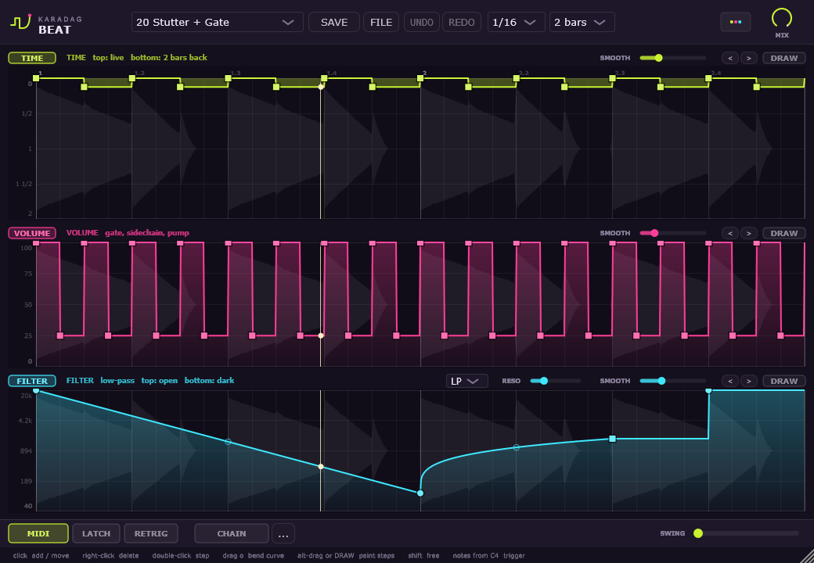

# Karadag Beat

A tempo-synced effect for chopping up audio: stutters, half-time, tape stops, reverse,
gates, sidechain pumps and filter sweeps. You draw them as envelopes over a 1, 2 or 4 bar loop.

VST3, Audio Unit and standalone app for Windows and macOS.



## Install

Download the installer for your system from
[Releases](https://github.com/TugberkKaradag/karadag-beat/releases/latest), run it,
then rescan plugins in your DAW.

**Windows 10+** (`KaradagBeat-x.y.z-Setup.exe`): installs the VST3 into
`C:\Program Files\Common Files\VST3`, which every VST3 host scans - Ableton Live,
FL Studio, Cubase, Studio One, Reaper, Bitwig and others. The installer isn't code-signed,
so Windows may say it's from an unknown publisher: click More info > Run anyway.

**macOS 10.15+** (`KaradagBeat-x.y.z-macOS.pkg`, Apple Silicon and Intel): installs the
VST3 and the Audio Unit for Logic Pro and GarageBand. The package isn't notarized, so macOS
blocks it the first time: open System Settings > Privacy & Security, click Open Anyway and
open the package again (on older macOS, right-click the package and choose Open).

## Triggering patterns from MIDI

Notes from C4 up select pattern slots. The plugin sits on an audio track, so send it MIDI
from another track:

- **Ableton Live**: on a MIDI track, set MIDI To to the audio track and pick Karadag Beat below it.
- **FL Studio**: set a MIDI input port in the plugin's wrapper settings and send a MIDI Out channel to that port.
- **Cubase**: set a MIDI track's output to Karadag Beat.
- **Reaper**: add a send from a MIDI track to the Karadag Beat track (audio: none, MIDI: all).
- **Logic Pro**: choose the track that plays the notes in the Side Chain menu of the plugin window.

## Features

- Time, volume and filter lanes
- 21 factory patterns, 27 slots for your own
- Trigger patterns from MIDI, with latch and retrigger
- Chain patterns across loops, swing
- Share patterns as `.kbeat` files

## Build

CMake 3.22+ and Visual Studio 2022+ (Windows) or Xcode command line tools (macOS).
JUCE 8.0.10 is downloaded automatically.

```
cmake -S . -B build -DCMAKE_BUILD_TYPE=Release
cmake --build build --config Release --target KaradagBeat_VST3
```

On Windows, `build.ps1` builds, runs the tests and installs the plugin. Options: `-SkipTests`,
`-Configure`, `-Validate` (runs [pluginval](https://github.com/Tracktion/pluginval) from
`tools\pluginval`), `-Installer` (builds the Setup with Inno Setup 6.5+).
On macOS, `installer/macos/package.sh <version>` builds the `.pkg` from a Release build.
